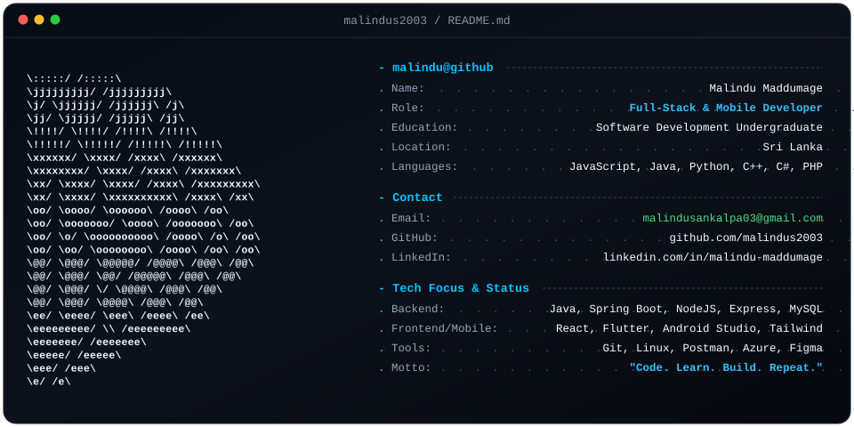

  # 👨‍💻 Malindu Maddumage
  ### 🚀 Full-Stack & Mobile Developer | Sri Lanka 🇱🇰

  

    
  

---

  

  &nbsp;
  &nbsp;
  &nbsp;
  

---

# 📊 GitHub Statistics

  
  
  

---

# 🏆 GitHub Achievements

  

---

  <b>⭐ "Code. Learn. Build. Repeat." ⭐</b>

